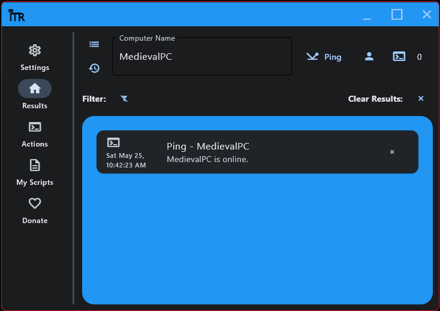

# IT Remote

IT Remote is a PowerShell GUI built using Python, Flet, and custom PowerShell scripts. Its goal is to allow you to get useful information from Windows PCs on your domain and troubleshoot them remotely.

Many of the functions can be done without interupting the user.
For exmaple: *getting their installed printers, renaming them, and even uninstalling them without any pop ups on their screen.*

# How Does It Work?

IT Remote uses PowerShell 7, and PsTools (specifically PsService.exe and PsExec.exe) to execute commands against or on remote machines. You can also run these commands on your own machine by typing "localhost" into the computer name field.

With Python's subprocess module, IT Remote launches custom powershell scripts with PowerShell 7 and feeds those scripts arguments acquired from input you provided in the app.

# What Can It Do?

* Ping a remote PC
* Get a list of installed printers and their info, rename them, uninstall them, and send testpages to them
* Schedule a restart on 1 or multiple PCs
* Obtain a list of all installed software or specific programs on 1 or multiple PCs
* Check available space on all attached disks on 1 or multiple PCs
* Clear space on 1 or multiple PCs including user profiles, Windows/Temp, Windows/Prefetch, and recycle bin
* Generate battery reports on 1 or multiple PCs and extract information like Design Capacity, Full Charge Capacity, and calculate the battery efficiency
* Perform useful actions at the click of a button like launch Event Viewer, MsInfo32, and the C$ admin share if enabled in your environment
* See whos logged in on a PC and log them off at the click of a button
* See the current uptime of a PC
* Add and launch your own scripts at the click of a button (supports native Windows PowerShell if your script doesnt work in PowerShell 7)
  

